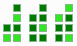

# Zigomar
A **Binary Clock** demo written in Win32 assembly language

# Techniques implemented
- unique instance using *Mutex*
- reading time
- drawing and combining regions of the screen
- context menus
- loading icons and bitmaps
- tray icon with date
- event handling
- toottip text
# Making and Linking
To make obj files and link them, use the **masm32** SDK, which you can download [here](http://www.masm32.com/). Masm32 uses Microsoft Macro assembler. The following supposes that you have *masm32* installed in ``d:\masm32`` and that binary folder ``d:\masm32\bin`` is in your path
- assemble the source with ``ml /c /coff /Cp /I "d:\masm32\include" /nologo zigomar.asm``, this will generate ``zigomar.obj``
- compile the resources by typing ``rc res.rc``, this will generate ``res.RES`` 
- ``link /SUBSYSTEM:WINDOWS /RELEASE /VERSION:4.0 /LIBPATH:"D:\masm32\lib" zigomar.obj res.RES`` will link the generated files
